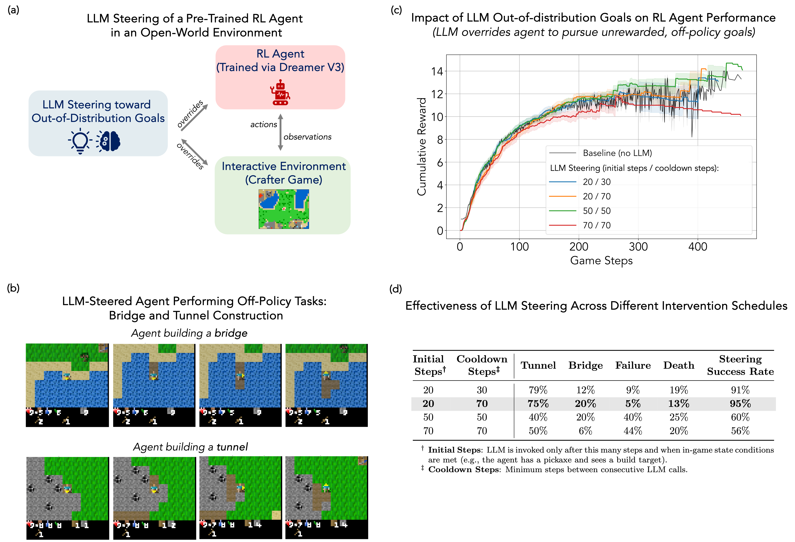

# LLM Steering of Pre-Trained RL Agents Toward Out-of-Distribution Goals

A research implementation investigating how large language models (LLMs) can expand the objective space of pre-trained reinforcement learning agents, enabling open-ended behavior in complex environments without retraining.

## Overview

This project explores a hybrid framework where a [DreamerV3](https://github.com/danijar/dreamerv3) agent trained on standard [Crafter](https://github.com/danijar/crafter) rewards is periodically overridden by an LLM issuing action sequences aimed at novel, unrewarded, and out-of-distribution objectives—such as building bridges or tunnels. We analyze the trade-offs between timing and frequency of LLM interventions and their effects on the agent's cumulative reward, revealing optimal intervention schedules that balance pursuit of new goals with preservation of the agent's native exploration behaviors.

## Technical Report

For more background, detailed results, and analysis, refer to the full [technical report](technical_report.pdf).

## Prerequisites

- Python 3.11+
- Complete dependency list in `requirements.txt`
- Pre-trained DreamerV3 checkpoint for Crafter 
- OpenAI API key 

### Running the Experiments

After cloning the repository, you can run `main.ipynb` notebook which admits `OPENAI_API_KEY` and a directory to your Dreamer policy checkpoint 

